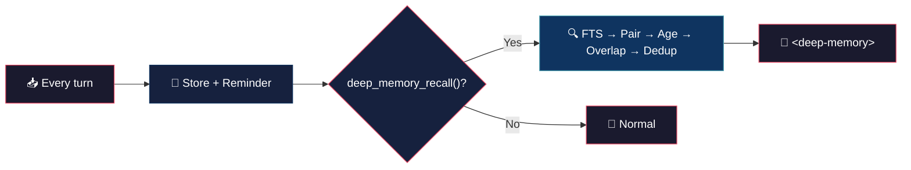

# Deep Memory (tiny brain, big thoughts)


> Every turn, stored for life. Recall when it matters — cross-project, cross-session, full-text.
> Your AI remembers. You just need to teach it to ask.

## 🧠 What it is

Three hooks. One job.

- **`experimental.chat.messages.transform`** — stores every turn (deduped by `session_id + content_hash`) into SQLite. Strips DCP/system/thinking/tool tags before indexing. Quiet, automatic, boring. Just how storage should be.
- **`experimental.chat.system.transform`** — appends a one-line reminder so the model knows `deep_memory_recall()` exists. That's it. No auto-injection, no 2000-token surprise. The model has to *want* to remember.
- **`tool.deep_memory_recall`** — FTS5 search across the **entire DB** (no session filter — yes, it's cross-project). Returns ranked hits with pair recall (user + following assistant), overlap filter, dedup, and token-budgeted compression.
- **`dispose`** — WAL checkpoint, close DB, remove exit listener. Clean break.

## 🔄 How it works



## 🏗️ Philosophy: stack-first

Memory is a **growing stack**, not a bounded cache. Everything is stored, nothing is pruned. The DB grows. The stack grows. Over time, thousands of turns accumulate.

Reading the stack is **proactive**, not automatic. The system prompt only carries a short reminder — the model must call `deep_memory_recall()` when it needs context. No forced injection, no token budget burned on irrelevant memories.

When the tool fires, the pipeline is straightforward:

- **FTS searches the whole stack** — `fts_results: 20` returns ranked hits, scored by FTS relevance × role weight (user hits get 3× boost) × recency decay (30-day half-life).
- **Pair recall** — every matching user turn brings its assistant follow-up. Context in pairs, not fragments.
- **Age filter** — `max_age_days` lives in SQL, not JS. Young results don't get pushed out by old ones.
- **Overlap filter** — recent conversation turns (up to `overlap_window: 8`) are compared via Jaccard similarity. If a hit repeats what was just said, it's out.
- **Dedup + budget** — within the remaining hits, similar content (Jaccard > `dedup_threshold: 0.6`) is collapsed. Then the top-ranked snippets fill the `max_tokens_memory: 2000` budget, truncated at `max_snippet_chars: 250`.
- **Cross-project** — the FTS query has no `session_id` filter. Searches everything. Always.

The result: a `<deep-memory>` block with the most relevant past context, curated and compressed. No auto-injection. No bloat.

## 🎯 Use cases

**History repeats.** You fixed a race condition in project A two months ago. Now you're debugging a similar issue in project B. The model recalls the exact fix pattern. Minutes saved: 30+.

**Architecture archaeology.** "Why did we choose SQLite over Postgres?" The model remembers the discussion from three sessions ago. No Slack digging, no git blame spelunking.

**Onboarding time machine.** A new feature touches code you discussed weeks ago. The model recalls the context, the trade-offs, the rejected alternatives. Old debates stay settled.

**Bug backtrack.** Same error message, different file. The model: "Last time this was a null pointer after the refactor." Fixed in seconds.

## 🚀 Build

```bash
bun build deep-memory.ts --target=bun --external="@opencode-ai/plugin"
```

Install by copying to plugins:

```bash
cp deep-memory.ts ~/.config/opencode/plugins/deep-memory.ts
```

## ⚙️ Configuration

`~/.config/opencode/deep-memory.json`:

```json
{
	"fts_results": 20,
	"max_tokens_memory": 2000,
	"max_age_days": 3000,
	"log_level": "info",
	"overlap_threshold": 0.5,
	"dedup_threshold": 0.6,
	"overlap_window": 8,
	"max_snippet_chars": 250
}
```

| Field | Default | Description |
|---|---|---|
| `fts_results` | `20` | Max FTS results per search |
| `max_tokens_memory` | `2000` | Token budget for compressed context |
| `max_age_days` | `3000` | Max age of recalled memories (`0` = forever) |
| `log_level` | `"info"` | `"silent"`, `"error"`, `"info"`, `"debug"` |
| `overlap_threshold` | `0.5` | Jaccard similarity threshold for overlap filter |
| `dedup_threshold` | `0.6` | Jaccard similarity threshold for dedup within recall |
| `overlap_window` | `8` | Recent turns to compare against for overlap filter |
| `max_snippet_chars` | `250` | Max chars per snippet before truncation |

## 💬 Notes

Less is more. :)

## 👤 Authors

- Alejandro Carraretto
- DeepSeek-V4

## 📄 License

MIT — version 1.0.28
