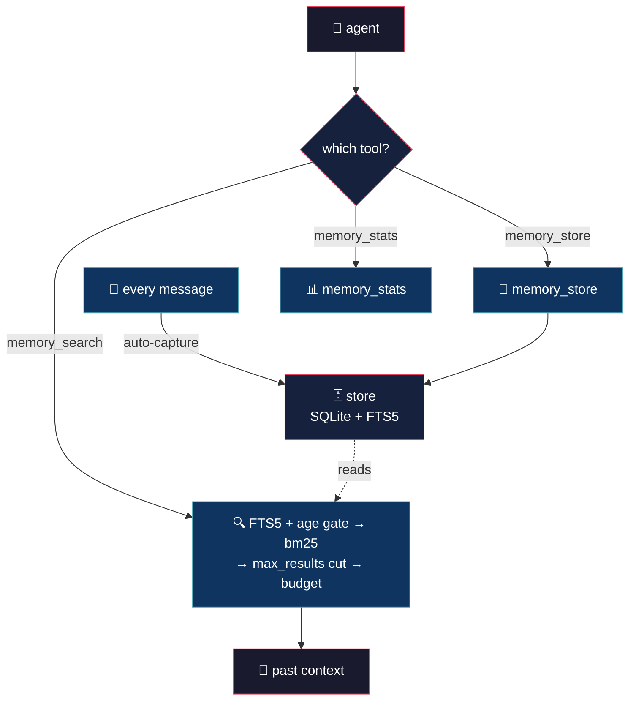

# Deep Memory (tiny brain, big thoughts)


> Your AI has amnesia. Every session starts from scratch? You repeat configs, decisions, errors you already fixed? Not anymore!

## 💡 What it does

> Your AI should remember. Period.

- **Global memory** — every message of every session, across every project. Nothing is scoped away. `search_max_days` bounds what search looks at, `data_keep_days` prunes the store at startup.

- **Auto memory** — every message saves itself. Junk tags get stripped. Near-duplicates skipped via trigram Jaccard > 0.65 over the recent 200 (min 20 chars). You do nothing.

- **Cross-project search** — that bug you fixed last week shows up on its own. SQLite FTS5, keyword + prefix matching.

- **Plain pipeline** — FTS5 → age gate → `bm25()` ranking → the `max_results` cut → the token budget. No embeddings, no LLM calls in retrieval.

- **Store on demand** — `memory_store(role, content)` persists a specific fact or decision. Same normalize and dedup gates as the automatic capture — just triggered by you.

- **Stats on demand** — `memory_stats()` returns record count, content size, DB file size, records per role, and oldest/newest record previews.

- **Copy and it works** — one TypeScript file (729 lines), native `bun:sqlite`. No npm, no node_modules, no drama.

- **Safe by design** — normalize, MD5 exact dedup, trigram near-dup gate, controlled startup prune. Ranking only reorders — it never filters a candidate out.

## 🧠 Philosophy

Memory is a growing stack, not a cache that gets cleaned. Everything saved.

The model decides when to ask. A short `<memory>` reminder in the system prompt points at `memory_search()` and `memory_store()`. No forced injection, no tokens wasted on noise.

When it asks, the search runs over the whole database — across projects, across sessions, across months — and returns only what matters.

## 🔄 How it works

One store; messages go in, searches come out.



Every message is captured automatically. `memory_store` saves one fact when the user explicitly asks. `memory_search` runs when the model needs past context: FTS5 over the whole store (age-gated) → `bm25()` ranking → the `max_results` cut → the token/snippet budget.

## 🧰 Tools

| Tool | What it does | Answer wrapped in |
|---|---|---|
| `memory_search(query, max_results?)` | Recall: FTS5 + bm25, compressed to a token budget | `<memory-result>` |
| `memory_store(role, content)` | Save one fact or decision | `<memory-store>` |
| `memory_stats()` | Counts, size, roles, oldest / newest record | `<memory-stats>` |

A short `<memory>` reminder is also injected into the system prompt.

## 🎯 Use cases

**History repeats.** You fixed a bug in project A two months ago. Now project B has something similar. The model remembers and hands you the fix. 30 minutes saved.

**The "why we used SQLite".** You discussed it three sessions ago. The model knows. No more Slack digging or git blame archaeology.

**Time machine.** A new feature touches code you discussed weeks ago. The model brings the context, the trade-offs, the discarded alternatives. Old debates, settled.

**Bug backtrack.** Same error message, different file. The model: "Last time it was a null pointer after the refactor." Fixed in seconds.

## 🚀 Installation

```bash
cp deep-memory.ts ~/.config/opencode/plugins/deep-memory.ts
```

No npm, no build step, no dependencies. OpenCode runs TypeScript natively. Restart opencode; capture runs on its own and the tools become available.

## ⚙️ Configuration

Copy `deep-memory.jsonc` (included in this repo) to `~/.config/opencode/` and edit:

```jsonc
{
	"enabled": true,            // master switch
	"max_results": 20,          // max FTS results returned per search call
	"search_max_days": 600,     // 0 = all, max days of records to consider
	"max_tokens_memory": 800,   // max tokens consumed by memory recall block
	"max_snippet_chars": 600,   // max chars per memory snippet in recall output
	"data_keep_days": 600,      // 0 = forever, prune records older than this on startup
	"log_level": "info"         // "silent" | "error" | "info" | "debug"
}
```

| Field | Default | Description |
|---|---|---|
| `enabled` | `true` | Master switch |
| `max_results` | `20` | Max FTS results per search |
| `search_max_days` | `600` | 0 = all, max days of records to consider |
| `max_tokens_memory` | `800` | Token budget for compressed context |
| `max_snippet_chars` | `600` | Max chars per snippet before truncation |
| `data_keep_days` | `600` | 0 = forever, prune records older than this on startup |
| `log_level` | `"info"` | `"silent"`, `"error"`, `"info"`, `"debug"` |

## 🪵 Logs

`~/.config/opencode/deep-memory.log` (append-only). Format: `[TIMESTAMP] [LEVEL] message`.

```bash
tail -f ~/.config/opencode/deep-memory.log
```

```log
[2026-09-17T01:20:00] [INFO]: Config loaded
[2026-09-17T01:20:00] [INFO]: Initialized
[2026-09-17T01:31:12] [INFO]: Stored: 2 records
[2026-09-17T01:35:40] [DEBUG]: Dedup: skipped similar record (role=assistant)
[2026-09-17T01:40:00] [INFO]: Disposed
```

## 💬 Notes

- **Auto-store** — every message saves itself. Junk tags get stripped. Near-duplicates skipped via trigram Jaccard > 0.65 over the recent 200, minimum 20 chars.
- **Exact dedup** — `id` (MD5, 32 chars) of `role + ":" + content.toLowerCase()` as `TEXT PRIMARY KEY` with `INSERT OR IGNORE` catches exact duplicates at insert.
- **Store on demand is not a bypass** — `memory_store` runs the same `storeRecord` (normalize + near-dup gate) as the automatic capture.
- **Relevance ranking** — FTS5 results ordered by `bm25()` (most relevant first), not insertion order.
- **Age gate** — `search_max_days` filters records in SQL via `julianday()` comparison. `0` = all records.
- **Cross-project** — FTS5 search has no session filter. Finds context across all projects and sessions.
- **System-injected parts** — message parts flagged `synthetic` or `ignored` are skipped during storage.
- **Startup prune** — `data_keep_days` deletes old records on init. `0` = forever.

Less is more. :)

## 👤 Authors

- Alejandro Carraretto
- DeepSeek-Flash — assistant model during development

## 📄 License

AGPL-3.0 — version 1.1.29
