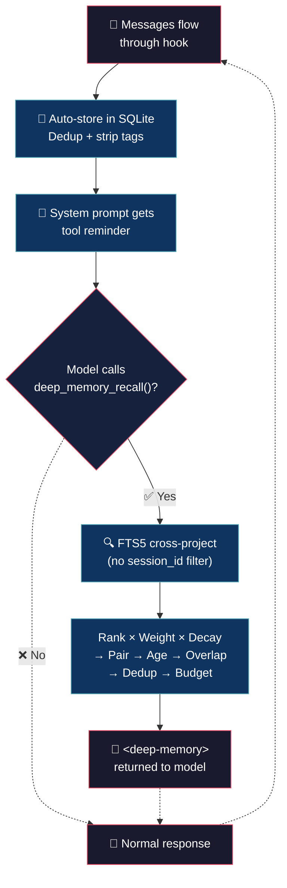

# Deep Memory (tiny brain, big thoughts)


> 595 lines. Zero external dependencies. SQLite FTS5 with diacritic-aware search.
> Every turn stored. Every session searchable. Cross-project by default.
> No database to install. No config to tweak. Your AI just remembers.

## 💡 What it does

- **Single-file plugin** — one TypeScript file (595 lines), Bun's built-in `bun:sqlite` and `node:crypto`. No `npm install`, no `node_modules`, no drama.

- **Automatic storage** — every turn saved with dedup by `session_id + content_hash`. DCP/system/thinking/tool tags stripped before indexing. Boring, reliable, background.

- **Cross-project FTS** — SQLite FTS5 with `unicode61 remove_diacritics 1`. No `session_id` filter — searches every memory across every project. Typo-tolerant prefix search included.

- **Smart recall pipeline** — FTS relevance × 3× user boost × recency decay → pair recall (user + assistant) → age filter (in SQL) → overlap filter (Jaccard) → dedup (Jaccard) → token budget (`max_tokens_memory: 2000`). Only the best context makes the cut.

## 🧠 Philosophy

Memory is a **growing stack**, not a bounded cache. Everything stored, nothing pruned. The DB grows, the stack grows, thousands of turns accumulate.

Reading the stack is **proactive**, not automatic. The system prompt carries a one-line reminder — the model must call `deep_memory_recall()` when it needs context. No forced injection, no tokens wasted on irrelevant noise.

When the tool fires, the pipeline curates: FTS across the entire DB → pair + age + overlap + dedup + budget → a `<deep-memory>` block with the most relevant past. Cross-project, always.

## 🔄 How it works



## 🎯 Use cases

**History repeats.** You fixed a race condition in project A two months ago. Now you're debugging a similar issue in project B. The model recalls the exact fix pattern. Minutes saved: 30+.

**Architecture archaeology.** "Why did we choose SQLite over Postgres?" The model remembers the discussion from three sessions ago. No Slack digging, no git blame spelunking.

**Onboarding time machine.** A new feature touches code you discussed weeks ago. The model recalls the context, the trade-offs, the rejected alternatives. Old debates stay settled.

**Bug backtrack.** Same error message, different file. The model: "Last time this was a null pointer after the refactor." Fixed in seconds.

## 🚀 Installation

```bash
cp deep-memory.ts ~/.config/opencode/plugins/
```

The plugin loads automatically when OpenCode starts. No manual registration required.

## ⚙️ Configuration

Copy `deep-memory.json` (included in this repo) to `~/.config/opencode/` and edit:

```json
{
	"fts_results": 20,
	"max_tokens_memory": 2000,
	"max_age_days": 3000,
	"log_level": "info",
	"overlap_threshold": 0.5,
	"dedup_threshold": 0.6,
	"overlap_window": 8,
	"max_snippet_chars": 250
}
```

| Field | Default | Description |
|---|---|---|
| `fts_results` | `20` | Max FTS results per search |
| `max_tokens_memory` | `2000` | Token budget for compressed context |
| `max_age_days` | `3000` | Max age of recalled memories (`0` = forever) |
| `log_level` | `"info"` | `"silent"`, `"error"`, `"info"`, `"debug"` |
| `overlap_threshold` | `0.5` | Jaccard similarity threshold for overlap filter |
| `dedup_threshold` | `0.6` | Jaccard similarity threshold for dedup within recall |
| `overlap_window` | `8` | Recent turns to compare against for overlap filter |
| `max_snippet_chars` | `250` | Max chars per snippet before truncation |

## 💬 Notes

Less is more. :)

## 👤 Authors

- Alejandro Carraretto
- DeepSeek-V4

## 📄 License

MIT — version 1.0.28
