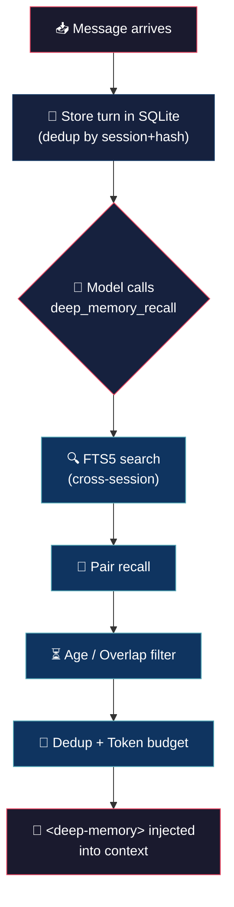

# Deep Memory (tiny brain, big thoughts)


> OpenCode plugin — SQLite FTS5 memory. Tiny footprint, massive recall.
> Stores every turn, cross-session, no pruning.
> Small package, big thoughts. A growing stack that never forgets.

## 🧠 What it is

- **`experimental.chat.messages.transform`** — stores each turn (deduped by `session_id + content_hash`) into SQLite. Strips DCP/system/thinking/tool tags before indexing.
- **`experimental.chat.system.transform`** — appends a reminder to use the `deep_memory_recall` tool.
- **`tool.deep_memory_recall`** — FTS5 search across the **entire DB** (cross-session, no session filter). Returns ranked hits with pair recall (user + following assistant), overlap filter, dedup, and token-budgeted compression.
- **`dispose`** — closes DB with WAL checkpoint, removes exit listener.

## 🔄 How it works



> The `system.transform` hook appends a `deep_memory_recall()` reminder each turn.

## 🏗️ Philosophy: stack-first

Memory is a **growing stack**, not a bounded cache. Every turn is stored, no pruning. FTS searches the whole DB (`fts_results: 20`) and injects up to `max_tokens_memory: 2000` tokens of compressed context at the front of the system prompt on every turn. The goal: thousands of records accumulate, FTS finds relevant context across the entire history, and the model always sees relevant past facts at the front of its working memory.

## 🚀 Build

```bash
bun build deep-memory.ts --target=bun --external="@opencode-ai/plugin"
```

Install by copying to plugins:

```bash
cp deep-memory.ts ~/.config/opencode/plugins/deep-memory.ts
```

## ⚙️ Configuration

`~/.config/opencode/deep-memory.json`:

```json
{
	"fts_results": 20,
	"max_tokens_memory": 2000,
	"max_age_days": 3000,
	"log_level": "info",
	"overlap_threshold": 0.5,
	"dedup_threshold": 0.6,
	"overlap_window": 8,
	"max_snippet_chars": 250
}
```

| Field | Default | Description |
|---|---|---|
| `fts_results` | `20` | Max FTS results per search |
| `max_tokens_memory` | `2000` | Token budget for compressed context |
| `max_age_days` | `3000` | Max age of recalled memories (`0` = forever) |
| `log_level` | `"info"` | `"silent"`, `"error"`, `"info"`, `"debug"` |
| `overlap_threshold` | `0.5` | Jaccard similarity threshold for overlap filter |
| `dedup_threshold` | `0.6` | Jaccard similarity threshold for dedup within recall |
| `overlap_window` | `8` | Recent turns to compare against for overlap filter |
| `max_snippet_chars` | `250` | Max chars per snippet before truncation |

## 💬 Notes

Less is more. :)

## 👤 Authors

- Alejandro Carraretto
- DeepSeek-V4

## 📄 License

MIT — version 1.0.28
