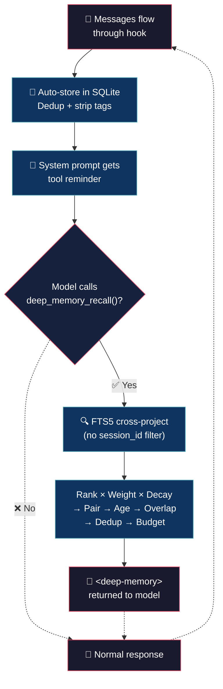

# Deep Memory (tiny brain, big thoughts)


> Tu AI tiene amnesia. Cada sesión arranca de cero. Repites configuraciones, decisiones, bugs que ya arreglaste.

## 💡 What it does

> Tu AI debería recordar. Punto.

- **Copia y funciona** — 595 líneas, bun:sqlite nativo. Sin npm, sin node_modules, sin drama.

- **Memoria automática** — cada mensaje se guarda solo. Tags inservibles se limpian. Tú no haces nada.

- **Busca entre proyectos** — el bug que resolviste la semana pasada aparece solo. SQLite FTS5, tolerante a errores de tipeo.

- **Pipeline inteligente** — relevancia × peso × antigüedad → par usuario/respuesta → solo el contexto justo.

## 🧠 Philosophy

La memoria es una pila que crece, no un caché que se limpia. Todo se guarda, nada se poda.

El modelo decide cuándo preguntar. Una línea en el system prompt le recuerda que existe `deep_memory_recall()`. Sin inyección forzada, sin tokens desperdiciados en ruido.

Cuando pregunta, el pipeline busca en toda la DB — entre proyectos, entre sesiones, entre meses — y devuelve solo lo que importa.

## 🔄 How it works



## 🎯 Casos de uso

**El déjà vu.** Arreglaste un bug en el proyecto A hace dos meses. Ahora en el proyecto B pasa algo similar. El modelo lo recuerda y te da la solución. 30 minutos ahorrados.

**El "por qué usamos SQLite".** Lo discutieron hace tres sesiones. El modelo lo sabe. No más buscar en Slack ni hacer arqueología en git blame.

**La máquina del tiempo.** Una feature nueva toca código que ya hablaste hace semanas. El modelo trae el contexto, los trade-offs, las alternativas descartadas. Viejos debates, ya saldados.

**El déjà vu del error.** El mismo mensaje de error, distinto archivo. El modelo: "La última vez fue un null pointer después del refactor." Arreglado en segundos.

## 🚀 Installation

```bash
cp deep-memory.ts ~/.config/opencode/plugins/
```

The plugin loads automatically when OpenCode starts. No manual registration required.

## ⚙️ Configuration

Copy `deep-memory.json` (included in this repo) to `~/.config/opencode/` and edit:

```json
{
	"fts_results": 20,
	"max_tokens_memory": 2000,
	"max_age_days": 3000,
	"log_level": "info",
	"overlap_threshold": 0.5,
	"dedup_threshold": 0.6,
	"overlap_window": 8,
	"max_snippet_chars": 250
}
```

| Field | Default | Description |
|---|---|---|
| `fts_results` | `20` | Max FTS results per search |
| `max_tokens_memory` | `2000` | Token budget for compressed context |
| `max_age_days` | `3000` | Max age of recalled memories (`0` = forever) |
| `log_level` | `"info"` | `"silent"`, `"error"`, `"info"`, `"debug"` |
| `overlap_threshold` | `0.5` | Jaccard similarity threshold for overlap filter |
| `dedup_threshold` | `0.6` | Jaccard similarity threshold for dedup within recall |
| `overlap_window` | `8` | Recent turns to compare against for overlap filter |
| `max_snippet_chars` | `250` | Max chars per snippet before truncation |

## 🪵 Logs

`~/.config/opencode/deep-memory.log` (append-only). Format: `[ISO_TIMESTAMP] [LEVEL] message`.

```bash
tail -f ~/.config/opencode/deep-memory.log
```

```log
[2026-07-05T10:30:00.000Z] [INFO]: Config loaded
[2026-07-05T10:30:01.000Z] [INFO]: Initialized | session: abc123def456
[2026-07-05T10:35:12.000Z] [INFO]: Stored: 2 turns
[2026-07-05T10:40:23.000Z] [INFO]: Stored: 5 turns
[2026-07-05T10:45:00.000Z] [INFO]: Disposed | session: abc123def456
[2026-07-05T10:50:00.000Z] [ERROR]: deep_memory_recall: connection timeout
[2026-07-05T10:55:00.000Z] [ERROR]: messages.transform: insert failed
```

## 💬 Notes

Less is more. :)

## 👤 Authors

- Alejandro Carraretto
- DeepSeek-V4

## 📄 License

MIT — version 1.0.28
