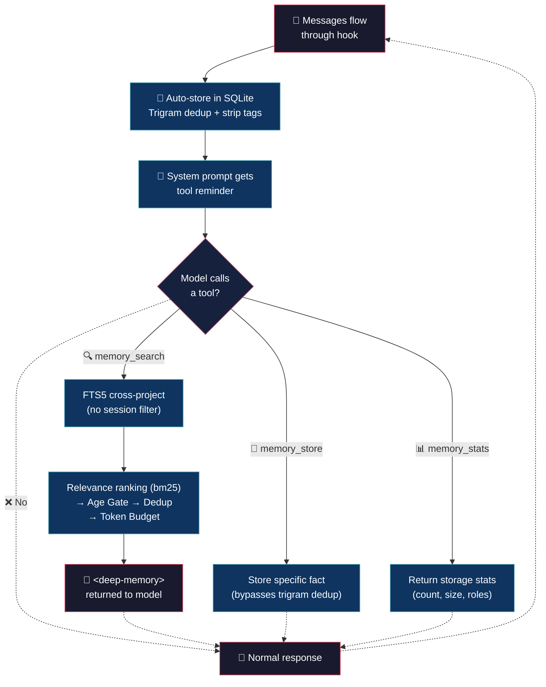

# Deep Memory (tiny brain, big thoughts)


> Your AI has amnesia. Every session starts from scratch? You repeat configs, decisions, errors you already fixed? Not anymore!
## 💡 What it does

> Your AI should remember. Period.

- **Copy and it works** — 898 lines, native bun:sqlite. No npm, no node_modules, no drama.

- **Auto memory** — every message saves itself. Junk tags get stripped. Near-duplicates skipped via trigram Jaccard > 0.65. You do nothing.

- **Cross-project search** — that bug you fixed last week shows up on its own. SQLite FTS5, typo-tolerant.

- **Smart pipeline** — FTS5 → age gate → `bm25()` relevance ranking → dedup → token budget. Storage-time in-memory trigram dedup skips near-duplicates.

- **Store on demand** — `memory_store()` lets you persist a specific fact or decision when you need it to stick. Same dedup, same pipeline — just triggered by you instead of automatically.

- **Stats on demand** — `memory_stats()` returns record count, content size, DB file size, records per role, and oldest/newest record previews.

## 🧠 Philosophy

Memory is a growing stack, not a cache that gets cleaned. Everything saved.

The model decides when to ask. A single line in the system prompt reminds it about `memory_search()`. No forced injection, no tokens wasted on noise.

When it asks, the pipeline searches the entire DB — across projects, across sessions, across months — and returns only what matters.

## 🔄 How it works



## 🎯 Use cases

**History repeats.** You fixed a bug in project A two months ago. Now project B has something similar. The model remembers and hands you the fix. 30 minutes saved.

**The "why we used SQLite".** You discussed it three sessions ago. The model knows. No more Slack digging or git blame archaeology.

**Time machine.** A new feature touches code you discussed weeks ago. The model brings the context, the trade-offs, the discarded alternatives. Old debates, settled.

**Bug backtrack.** Same error message, different file. The model: "Last time it was a null pointer after the refactor." Fixed in seconds.

## 🚀 Installation

```bash
cp deep-memory.ts ~/.config/opencode/plugins/deep-memory.ts
```

No npm, no build step, no dependencies. OpenCode runs TypeScript natively.

## ⚙️ Configuration

Copy `deep-memory.jsonc` (included in this repo) to `~/.config/opencode/` and edit:

```jsonc
{
	"enabled": true,            // master switch
	"max_results": 20,          // max FTS results returned per search call
	"search_max_days": 600,     // 0 = all, max days of records to consider
	"max_tokens_memory": 2000,  // max tokens consumed by memory recall block
	"max_snippet_chars": 3000,  // max chars per memory snippet in recall output
	"data_keep_days": 1000,     // 0 = forever, prune records older than this on startup
	"log_level": "info"         // "silent" | "error" | "info" | "debug"
}
```

| Field | Default | Description |
|---|---|---|
| `enabled` | `true` | Master switch |
| `max_results` | `20` | Max FTS results per search |
| `search_max_days` | `600` | 0 = all, max days of records to consider |
| `max_tokens_memory` | `2000` | Token budget for compressed context |
| `max_snippet_chars` | `3000` | Max chars per snippet before truncation |
| `data_keep_days` | `1000` | 0 = forever, prune records older than this on startup |
| `log_level` | `"info"` | `"silent"`, `"error"`, `"info"`, `"debug"` |

## 🪵 Logs

`~/.config/opencode/deep-memory.log` (append-only). Format: `[TIMESTAMP] [LEVEL] message`.

```bash
tail -f ~/.config/opencode/deep-memory.log
```

```log
[2026-07-05T10:30:00] [INFO]: Config loaded
[2026-07-05T10:30:01] [INFO]: Initialized
[2026-07-05T10:35:12] [INFO]: Stored: 1 record
[2026-07-05T10:40:23] [INFO]: Stored: 1 record
[2026-07-05T10:45:00] [INFO]: Disposed
```

## 💬 Notes

- **Auto-store** — every message saves itself. Junk tags get stripped. Near-duplicates skipped via trigram Jaccard > 0.65 (min 20 chars).
- **Exact dedup** — `content_hash` (MD5, 32 chars) of `role + ":" + content.toLowerCase()` with a `UNIQUE` constraint catches exact duplicates at insert.
- **`memory_store` bypass** — on-demand storage skips trigram dedup (intentional persistence). Same `content_hash` dedup still applies.
- **Relevance ranking** — FTS5 results ordered by `bm25()` (most relevant first), not insertion order.
- **Age gate** — `search_max_days` filters records in SQL via `julianday()` comparison. `0` = all records.
- **Cross-project** — FTS5 search has no session filter. Finds context across all projects and sessions.
- **System-injected parts** — message parts flagged `synthetic` or `ignored` are skipped during storage.
- **Startup prune** — `data_keep_days` deletes old records on init. `0` = forever.

Less is more. :)

## 👤 Authors

- Alejandro Carraretto
- DeepSeek-V4

## 📄 License

MIT — version 1.1.21

## 📋 Changelog

### v1.1.21

- **Trigram dedup redesign:** replaced fragile FTS5 trigram query (`records_trigram` table + triggers + `stmtTrigramSearch`) with in-memory Jaccard computation. `DeepMemory.isSimilar()` now fetches 200 recent records and computes trigram Jaccard directly — eliminates FTS5 syntax errors from special characters (`.`, `<`, etc.). Per-message error isolation in `handleMessagesTransform()` prevents one bad message from aborting the entire transform. Added `dedup_skipped` metric to `memory_stats`.

### v1.1.20

- **`memory_stats` tool:** new tool that returns storage statistics — record count, content size, DB file size, records per role, oldest/newest record with preview.

### v1.1.19

- **Seen Set cap:** added FIFO eviction cap at 10000 entries for the incremental store `seen` Set (later reverted — unnecessary for session-bound plugin).

### v1.1.18

- **Trigram storage-time dedup:** in-memory Jaccard over character 3-grams. `DeepMemory.isSimilar()` fetches 200 recent records and computes trigram Jaccard > 0.65 before insert, skipping near-duplicates (min 20 chars). No FTS5 trigram table — eliminates syntax errors from special characters. `memory_store` tool bypasses this (intentional persistence).
- **Rename:** `sanitizeFtsQuery` → `sanitizeQuery`.

### v1.1.17

- **`memory_store` tool:** new tool that stores a specific fact, decision, or piece of information on demand. Delegates to existing `Storage.storeRecords()` (same dedup via `content_hash UNIQUE`, same `normalizeContent()` pipeline). Complements the auto-store hook — use for intentional persistence of key facts, decisions, or project context.

### v1.1.13

- **Version bump** to 1.1.13 (unify major.minor across the three plugins).

### v1.0.55

- **Version bump** to 1.0.55.

### v1.0.54

- **`FILTER_PATTERNS` applied globally** — `normalizeContent()` compiles each pattern with the `g` flag so all noise-tag occurrences are stripped, not just the first match.
- **Rename:** constant `STRIP_PATTERNS` → `FILTER_PATTERNS`.

### v1.0.53

- **Hooks `async`:** `experimental.chat.messages.transform`, `experimental.chat.system.transform` y `dispose` ahora `async` (return `Promise<void>`), cumplen contrato `satisfies Plugin`.
- **Incremental store:** `DeepMemory` trackea ids vistos (`seen: Set`) en `handleMessagesTransform`; saltea mensajes ya almacenados. Evita re-normalizar todo el historial cada turno (opencode pasa el historial completo en `messages.transform`). Dedup `UNIQUE` sigue como backstop tras reinicio.
- **`sanitizeFtsQuery` F7-B:** regex separa en cualquier no-alfanumérico y umbral baja a >1 char. Recupera queries con separadores (`node.js`→`node js`) e identificadores cortos (`go`, `js`, `py`).

### v1.0.52

- **Config rename:** `fts_results` → `max_results`, `max_age_days` → `search_max_days`.
- **New config key:** `data_keep_days` (old `max_age_days` split into age gate + prune). Default 1000.
- **Startup prune:** `Storage.prune()` runs on init via `data_keep_days`, deletes old records.
- **max_results default:** 5 → 20.
- **search_max_days default:** 3000 → 600.
- **Docs alignment:** README.md and AGENTS.md corrected to match code — `bm25()` relevance ranking, correct defaults.
- **Storage normalization:** `normalizeContent()` collapses whitespace runs to a single space before insert (lossless for FTS, smaller DB, stricter dedup via `content_hash`).

### v1.0.42

- **`enabled` flag:** nuevo campo `"enabled": true/false` en config. Si es `false`, el plugin retorna `{}` sin registrar hooks. Patrón tomado de model-failover.

### v1.0.41

- **Schema v3:** Removed `entities` column. FTS5 changed from standalone (`content, entities` with `prefix`) to **external content** over `records.content` only. Triggers simplified. `user_version` stays 2.
- **Removed features:** `extractEntities()`, `entity_weight`, `context_window` (+ `getContextWindow()`), `recency_halflife`, `overlap_window`, `overlap_threshold`, `dedup_threshold` (config), `getRecentRecords()`, overlap filter in `recall()`, `process.once("exit")`, BM25F → native `rank`.
- **Restored search_max_days in SQL WHERE:** age gate is real again via `julianday()` comparison in the query, configurable via `search_max_days`. Default 600 days.
- **Config reduced to 7 keys:** `enabled`, `max_results`, `search_max_days`, `max_tokens_memory`, `max_snippet_chars`, `data_keep_days`, `log_level`.
- **max_results:** 20 → 5.
- **max_snippet_chars:** 250 → 3000.
- **Comments added:** Full function-level comments matching v1.0.35 style, adapted to current implementation.
