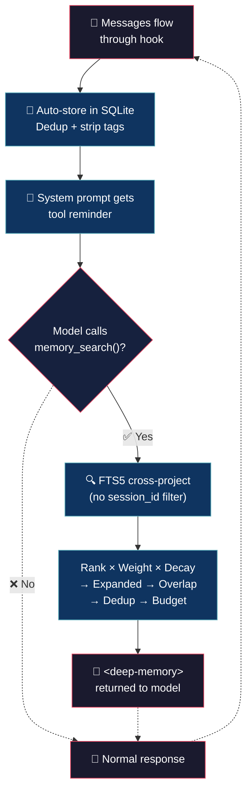

# Deep Memory (tiny brain, big thoughts)


> Your AI has amnesia. Every session starts from scratch. You repeat configs, decisions, bugs you already fixed.

## 💡 What it does

> Your AI should remember. Period.

- **Copy and it works** — 714 lines, native bun:sqlite. No npm, no node_modules, no drama.

- **Auto memory** — every message saves itself. Junk tags get stripped. You do nothing.

- **Cross-project search** — that bug you fixed last week shows up on its own. SQLite FTS5, typo-tolerant.

- **Smart pipeline** — relevance × weight × age → user/response pair → just the right context.

## 🧠 Philosophy

Memory is a growing stack, not a cache that gets cleaned. Everything saved, nothing pruned.

The model decides when to ask. A single line in the system prompt reminds it about `memory_search()`. No forced injection, no tokens wasted on noise.

When it asks, the pipeline searches the entire DB — across projects, across sessions, across months — and returns only what matters.

## 🔄 How it works



## 🎯 Use cases

**History repeats.** You fixed a bug in project A two months ago. Now project B has something similar. The model remembers and hands you the fix. 30 minutes saved.

**The "why we used SQLite".** You discussed it three sessions ago. The model knows. No more Slack digging or git blame archaeology.

**Time machine.** A new feature touches code you discussed weeks ago. The model brings the context, the trade-offs, the discarded alternatives. Old debates, settled.

**Bug backtrack.** Same error message, different file. The model: "Last time it was a null pointer after the refactor." Fixed in seconds.

## 🚀 Installation

```bash
cp deep-memory.ts ~/.config/opencode/plugins/
```

The plugin loads automatically when OpenCode starts. No manual registration required.

## ⚙️ Configuration

Copy `deep-memory.jsonc` (included in this repo) to `~/.config/opencode/` and edit:

```jsonc
{
	"fts_results": 20,
	"max_tokens_memory": 2000,
	"max_age_days": 3000,       // 0 = forever
	"overlap_threshold": 0.5,
	"dedup_threshold": 0.6,
	"overlap_window": 8,
	"max_snippet_chars": 250,
	"context_window": 2,
	"entity_weight": 3.0,
	"recency_halflife": 30,
	"log_level": "info"         // "silent" | "error" | "info" | "debug"
}
```

| Field | Default | Description |
|---|---|---|
| `fts_results` | `20` | Max FTS results per search |
| `max_tokens_memory` | `2000` | Token budget for compressed context |
| `max_age_days` | `3000` | Max age of recalled memories (`0` = forever) |
| `log_level` | `"info"` | `"silent"`, `"error"`, `"info"`, `"debug"` |
| `overlap_threshold` | `0.5` | Jaccard similarity threshold for overlap filter |
| `dedup_threshold` | `0.6` | Jaccard similarity threshold for dedup within recall |
| `overlap_window` | `8` | Recent records to compare against for overlap filter |
| `max_snippet_chars` | `250` | Max chars per snippet before truncation |
| `context_window` | `2` | ±N surrounding records per FTS hit (`0` = off) |
| `entity_weight` | `3.0` | BM25F weight for entities column (≥ 1.0) |
| `recency_halflife` | `30` | Exponential decay half-life in days |

## 🪵 Logs

`~/.config/opencode/deep-memory.log` (append-only). Format: `[TIMESTAMP] [LEVEL] message`.

```bash
tail -f ~/.config/opencode/deep-memory.log
```

```log
[2026-07-05T10:30:00] [INFO]: Config loaded
[2026-07-05T10:30:01] [INFO]: Initialized
[2026-07-05T10:35:12] [INFO]: Stored: 1 record
[2026-07-05T10:40:23] [INFO]: Stored: 1 record
[2026-07-05T10:45:00] [INFO]: Disposed
```

## 💬 Notes

Less is more. :)

## 👤 Authors

- Alejandro Carraretto
- DeepSeek-V4

## 📄 License

MIT — version 2.0.0
